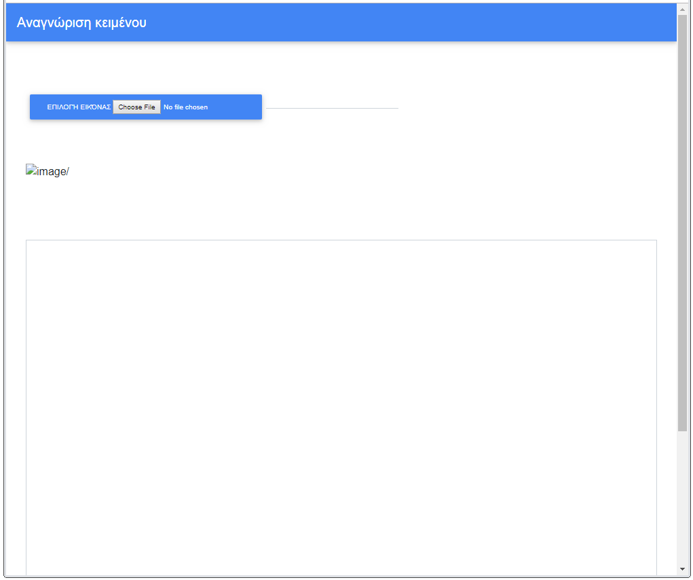
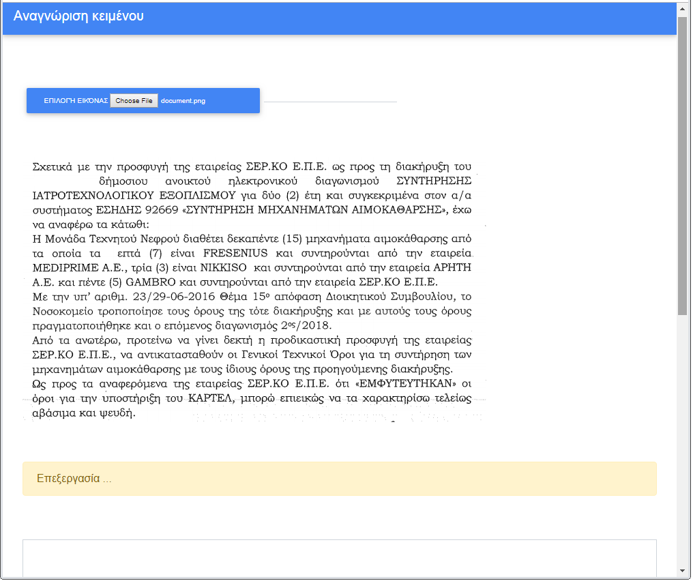
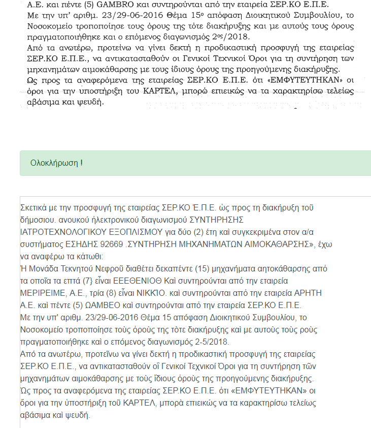

                                        Web OCR app
                                        
A Web OCR (optical character recognition) app where the user is able to choose any image file *(.jpg,.png,.bmp,.etc)*  and get **greek text** from it. The user is informed via appropriate messages during OCR process.

This Web app has been made via [Golang](https://golang.org/), [mdbootstrap](https://mdbootstrap.com/), [tesseract-ocr](https://github.com/tesseract-ocr/tesseract) and also [gin utility app](https://github.com/codegangsta/gin) for its successful operation.

**General view**

**Process view**

**Success view**

